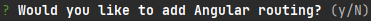
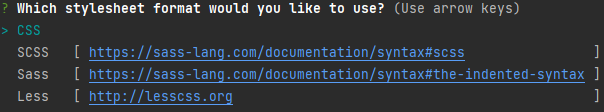
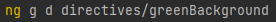

# Angular e-Portfolio

###About this repository:

This repository was created in the course of an e-portfolio at the DHBW-Karlsruhe. It contains a guide on how to get started with an Angular project and the most important knowledge to do so. Except for the guide, this repository contains an Angular project that practically applies the techniques explained in the guide.

## Table of Contents

### 1. [Introduction](#introduction)
### 2. [Installation](#installation)
### 3. [Getting started](#getting-started)

# 1. Introduction
Angular is an open source, platform-agnostic web application framework for building single page (SPA) applications. Angular applications can be segmented into building blocks. Building blocks are among others components, directives, pipes and services.
### <u>Components</u>
    <app-custom-button></app-custom-button>
Components are used to describe a reusable, UI related piece of the application that has a custom DOM element. Components consist of an HTML template, a typescript implementation class, a stylesheet file and a unit testing class.

Learn more about components
### <u>Directives</u>
    <app-custom-button greenBackground></app-custom-button>
Directives are used to describe a DOM element. Thereby directives are UI related and can be used in a reusable way.

Learn more about directives
### <u>Pipes</u>
    {{helloString | uppercase}} => HELLO
Pipes are used to transform displaying data without changing the underlying data.

Learn more about pipes
### <u>Services</u>
Services are non-UI related, can be used in a reusable way and provide logic to the application. Services consist of a typescript implementation class and a unit testing class.

Learn more about services

# 2. Installation
First, the <b>Angular CLI</b> needs to be installed.  
The Angular CLI is the command line interface for Angular. With the Angular CLI, you can create new projects, build and serve your Angular applications, install additional modules, and more.

Installing the Angular CLI (Node Package Manager (NPM) required):

    npm install -g @angular/cli

# 3. Getting Started
<u style="font-size:1.5rem;"><b>Creating a new project</b></u> 
After installing the Angular CLI, you can create a new project by running the following command:
  
    ng new <project-name>

In the following dialog you will be asked if you also want to install Angular routing:
 
<b>Angular routing:</b> 
As depicted above, Angular is a single page application framework that changes the views by showing or hiding portions of the display that correspond to particular components, rather than requesting the server for a new page.  
However, interacting with the application may require moving between different views. These navigations are handled by the Angular routing system. 

Next, you will be asked for the type of stylesheet format you want to use:  
 
This may be personal preference, in this project however, Sass will be used.

<u style="font-size:1.5rem;"><b>Starting the development server</b></u> 
After creating the project, all required files will be generated. To get a first look at the application, you can start the development server by running the following command:  

    ng serve
and open your browser to http://localhost:4200/ or

    ng serve --open
to open the application directly in your browser.  
Until now the application should only consist of an Angular template.

<u style="font-size:1.5rem;"><b>The working directory</b></u> 
By creating the Angular project, many files are also generated. The main directory however, is the <b>src/app</b> directory. This directory contains the application code and will be exclusively dealt with in this tutorial.

By default, the <b>src/app</b> directory only contains the root component, the <b>app.module.ts</b> file, which describes how the application fits together, and the routing file.
Inside the root components html class (by default <b>app.component.html</b>) you can find the Angular template you have seen in the browser. To begin with developing the application this code can be deleted.

<u style="font-size:1.5rem;"><b>Creating a component</b></u> 
To begin developing the application, you need to create a component. This is done by running the following command:

    ng generate component <component-name>
or

    ng g c <component-name>
The new component will be created in the <b>src/app</b> directory.
The html, stylesheet and typescript code can be written directly in the generated files. To be able to see the component however, it needs to be added to the root component. This is done by the syntax mentioned in the component section:

    <app-<component-name>></app-<component-name>>
In addition to that, the component needs to be added to the <b>app.module.ts</b> file. This file contains the declarations of all components and directives. However, normally this is done by Angular automatically.

<u style="font-size:1.5rem;"><b>Creating a directive</b></u> 
After creating a component, we want to manipulate the styling of the component (a DOM element). This is done by using directives. Directives can be created by running the following command:

    ng generate directive <directive-name>
or

    ng g d <directive-name>
To be able to differentiate between components, directives and other building blocks, we may want to create the directives in a separate directory:
 
By applying this code e.g.

    constructor(private elementRef: ElementRef) {
      this.elementRef.nativeElement.style.backgroundColor = 'green';
    }
to the directive, every DOM element that is manipulated with this directive will have a green background.

<u style="font-size:1.5rem;"><b>Creating a pipe</b></u> 
Now, we are able to manipulate the styling of our components, but we want to be able to display the data of our components in a more readable way. This is done by pipes. Pipes can be created by running the following command:

    ng generate pipe <pipe-name>
or

    ng g p <pipe-name>
If we e.g. have a string array of text we want to use on our site and do not want to modify the array, we can create a pipe that transforms this array into a string by using the following code inside the pipe class:

    transform(value: string[]) {
      return value.join(' ');
    }
The pipe can then be used with the pipe operator:

    {{array | <pipe-name>}}
<u style="font-size:1.5rem;"><b>Creating a service</b></u> 
To be able to separate UI code inside our component class from logic (e.g. HTTP requests or user management), we can use services. Services can be created by running the following command:

    ng generate service <service-name>
or

    ng g s <service-name>
Methods in these classes can easily be used in an object-oriented way.
